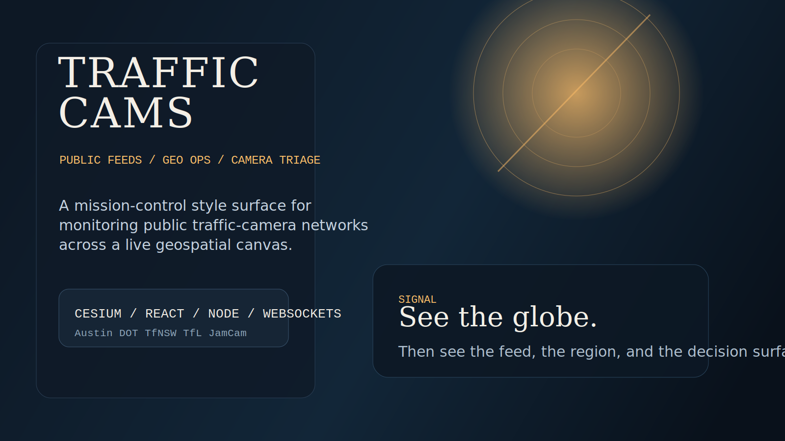
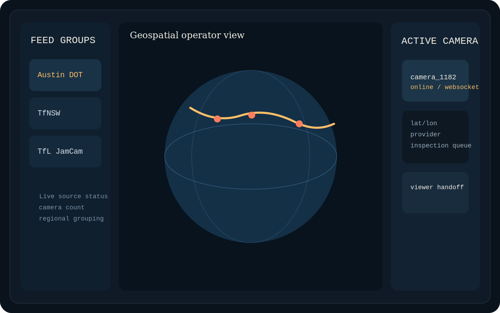
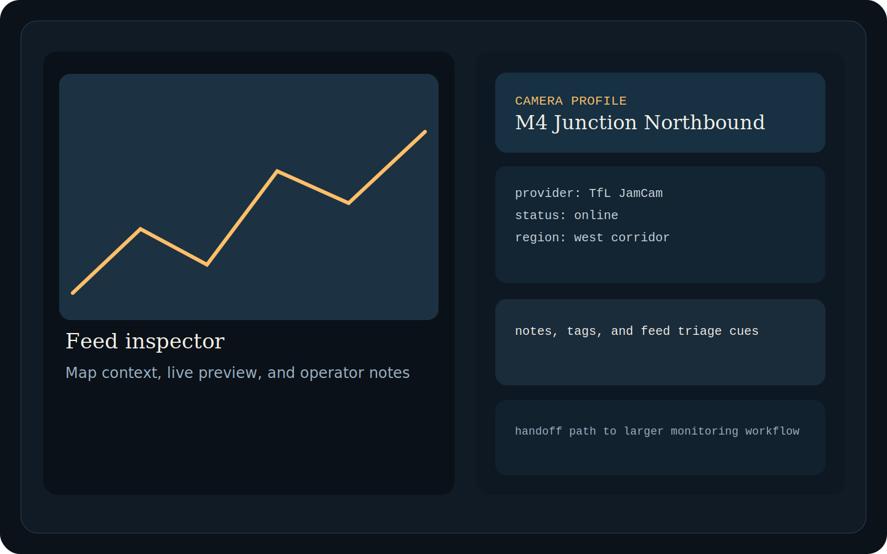

# Traffic Cams

Geo-ops prototype for monitoring public traffic-camera networks through a 3D globe interface.

Built for operators who need fast geospatial awareness, feed triage, and a clean path from raw camera inventory to a mission-control surface.

## Visual Tour

See [docs/landing.md](docs/landing.md) for the full landing page, screenshot notes, and portfolio framing.

This project combines a Cesium/React frontend with a Node.js aggregation layer that normalizes camera feeds from multiple public sources and pushes updates over WebSockets. The result is a mission-control style interface for situational awareness, feed inspection, and rapid camera triage.

## Why It Fits This Portfolio

- Shows geospatial UI design and realtime data ingestion.
- Connects public infrastructure feeds to an operator-facing workflow.
- Demonstrates how civilian traffic awareness tooling maps onto defense-adjacent monitoring and command-center patterns.

## Why This Repo Exists

Most public camera projects stop at map markers or raw API scraping. This repo exists to show the next layer up: how to turn noisy public infrastructure feeds into an operator-facing workflow with geographic context, realtime updates, and a readable control surface.

## Current Scope

- 3D globe view built with Cesium and Resium
- live feed selection and inspector panel
- normalized polling for Austin DOT, Sydney TfNSW, and London TfL JamCam sources
- WebSocket broadcast from backend aggregator to frontend clients

## Stack

- React 19
- Vite
- Cesium / Resium
- Node.js / Express / WebSocket
- LanceDB and Influx dependencies staged for backend evolution

## Local Run

1. Copy `.env.example` to `.env` and fill in the local keys you need.
2. Install backend dependencies in `server/` with `npm install`.
3. Install frontend dependencies in `client/` with `npm install`.
4. Start the backend with `npm start` from `server/`.
5. Start the frontend with `npm run dev` from `client/`.

## Verification

- Backend tests: `cd server && npm test`
- Frontend build: `cd client && npm run build`

## Public Data and Privacy

This repo is structured for public-safe publication:

- secrets were removed from tracked files
- `.env` files are ignored and replaced with `.env.example`
- the app is designed around public traffic feeds rather than user data

See [docs/landing.md](docs/landing.md), [docs/architecture.md](docs/architecture.md), and [docs/privacy-and-data.md](docs/privacy-and-data.md).
