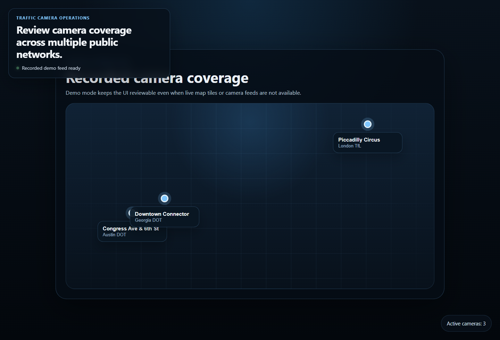
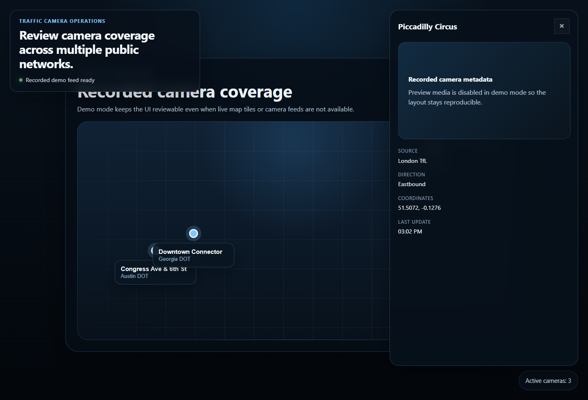

# Traffic Cams Walkthrough

Traffic Cams is easiest to judge as an app, not as a concept. Start with the screenshots, then read the backend and frontend together.

## Evidence

The overview shows the shared coverage surface used to review multiple public camera networks at once.

The selected-camera view shows the handoff from map coverage to the operator detail panel.

## What To Review

1. Read [README.md](../README.md) for the short summary and demo instructions.
2. Open [`server/aggregator.js`](../server/aggregator.js) to see how the source payloads are normalized.
3. Open [`client/src/App.tsx`](../client/src/App.tsx) and [`client/src/components/GlobeView.tsx`](../client/src/components/GlobeView.tsx) to see how the UI consumes the normalized feed.

## Why The Demo Path Exists

Live map tiles and camera feeds are useful for development, but they are a poor foundation for a public repo review. The demo path keeps the camera coverage surface, the inspector, and the screenshot flow reproducible without relying on private keys or live network conditions.
